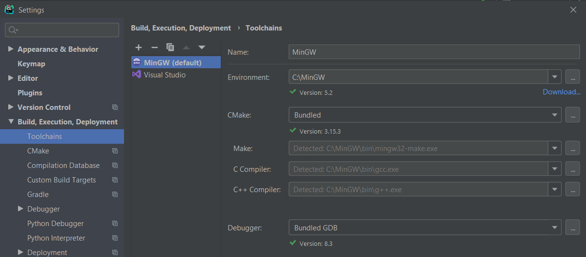

# Rendu exercices C++
Par Florian Lafuente

## Rendu
Pour lancer le rendu :

    $ git clone https://github.com/paralixo/pokemon.git
    $ cd pokemon
    $ ./cmake-build-debug/pokemon.exe

Les fichiers `MakeFile, CMakeLists, ...` ont été autogénérés par l'IDE CLion (JetBrains).

Configuration CLion : 

## Problemes
- pointeur lié au pokemon actif (qui a apporté beaucoup d'ennuis)
- probleme de pointeur incompréhensible sur l'ajout de pokemon une fois que l'équipe est pleine
- erreur lorsqu'on veut modifier les pokemons de l'equipe et qu'on a aucun pokemon dans la liste de pokemon
- pas de listes d'attaques spécifiques

J'aimerai vraiment avoir une correction (surtout pour la gestion du pokemon actif) car je pense n'avoir que la théorie sur les pointeurs mais dans la pratique il y a toujours une erreur.

## Bonus
- Soin des pokemons
- Choix du starter (automatique)